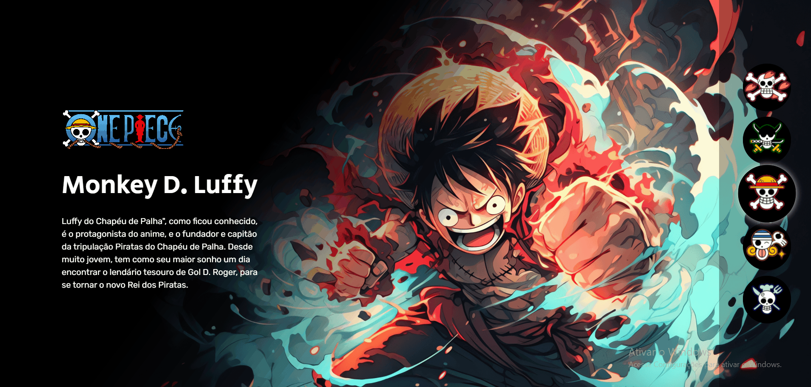

# Projeto One Piece

## Descrição
Projeto realizado durante a Semana Do Zero Ao Programador Contratado, evento realizado pelos DevEmDobro.

## Objetivos
- Apresentar 5 personagens do anime One Piece e a descrição de cada um dos personagens
- Veja o layout ideal dependendo do tamanho da tela do dispositivo
- Veja os estados de foco para elementos interativos

## Desktop Preview

### Mobile Preview

## Tecnologias
- HTML
- CSS
- JS 